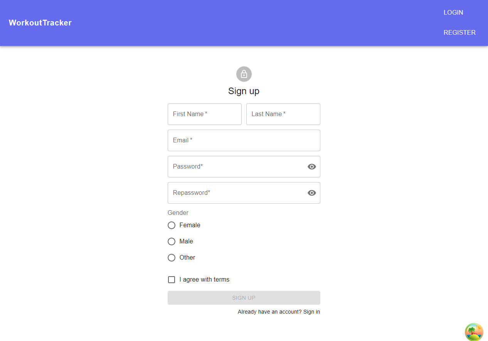

# Workout Tracker

This repository contains my front-end react project, developed in collaboration with a friend who built the [back-end API](https://github.com/Wojtur28/WorkoutTracker). The app helps users track their workout routines and body measurements progress.

Technologies used in this project:

<p>


</p>

## What is this project about?

This project provides simple and intuitive platform, where users can record and review their training results, they also can track their body measurements over time and visualize progress using charts or check history with infinite loading. Home page dashboard offers all essential informations with easy navigation to different app sections.

Checkout screenshots from the application on features overview section.

## Setting up project and commands

Clone this repository:

```bash
git  clone  https://github.com/Finnick223/WorkoutTracker
```

Go to the project and install:

```bash
npm  install
```

Running app as dev:

```bash
npm  run  dev
```

Running prettier:

```bash
npm  run  format
```

Running eslint:

```bash
npm  run  lint
```

Running husky:

```bash
npm  run  prepare
```

Running unit tests:

```bash
npm  run  test
```

Running e2e tests:

```bash
npm  run  cy:open
```

## Design

Design of this app is based on [MaterialUI](https://mui.com/material-ui/) components, but is created by myself without any UI tools like Figma. So it where built on the fly aiming to provide a clean, simple user interface and ensuring responsiveness across devices.

I also created dark theme, which can be found at settings in profile page.

It isn't fancy but I were focused on funcionality part.

## Features overview

There is a list of features that I've already implemented.

### Technologies

- [x] React Query for efficient data fetching and caching
- [x] React Hook Form for form handling
- [x] ESLint, Prettier, Husky, Lint-Staged for code readability
- [x] Material UI for a clean components and responsiveness
- [x] Framer-motion for providing simple animations
- [x] Vitest, Testing-Library and Cypress to provide unit, integration and e2e tests
- [x] Github Actions to implement CI feature

### Auth

- [x] Users authentication with JWT token
- [x] validation on login and register (disable button and show helper text)
- [x] resetting password




### Dashboard

- [x] Showing welcome text and quick navigation to other parts
- [x] Showing last measurement
- [x] Showing weight progress chart
- [x] Showing exercise stats chart
- [x] Showing date of last training and link to navigate


### Training section

#### Training panel

- [x] User can manage workout cards, add, edit and delete
- [x] Pagination dynamically adjusts based on available data, preventing navigation to empty pages


#### Exercise panel

- [x] User can manage exercise grid (add,edit,delete)
- [x] User have predefined exercises name list
- [x] User can't add negative number
- [x] User can set number of sets


### User section

#### New Measurements

- [x] User can add common body measurements
- [x] User can see animated body based on currenty hovered measurement


#### Measurements History

- [x] Users can track how their measurements changed in time
- [x] History is based on infinite loading button


#### Measurements Charts

- [x] Users can view their measurements in a dynamic line chart


### Profile section

#### Account

- [x] Users can see and edit personal informations

#### Settings

- [x] Users can set Dark Mode option


### Footer


## TODO

- [ ] Add avatar funcionality
- [ ] Create new welcome page
